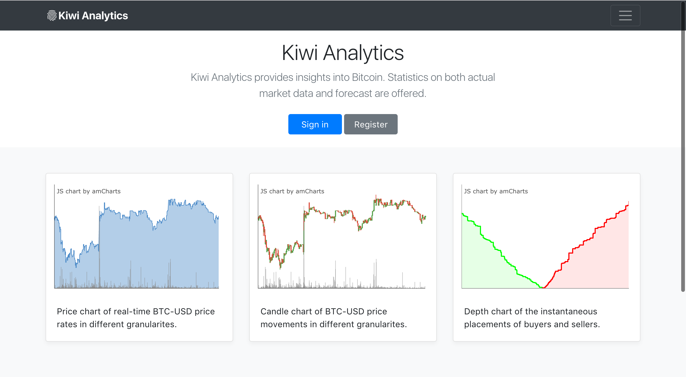
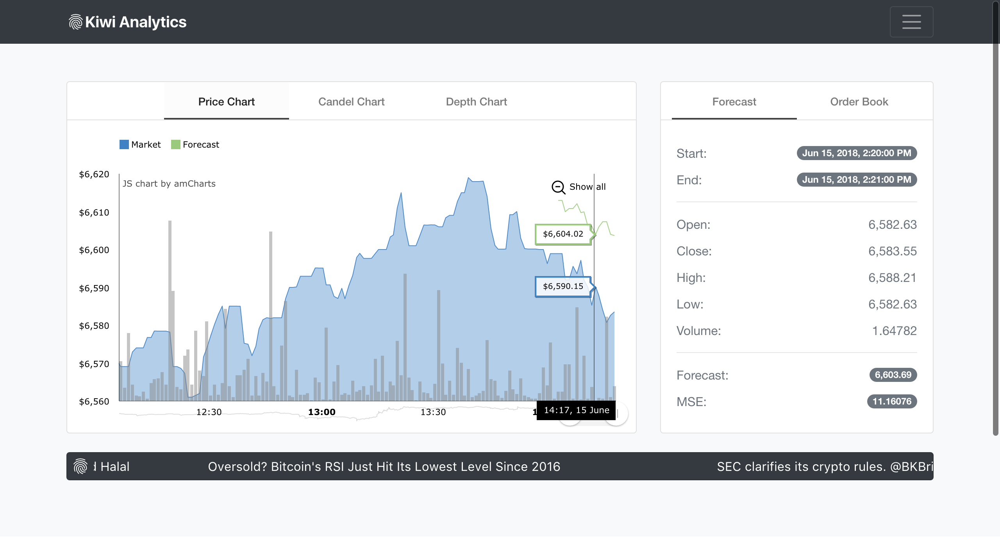
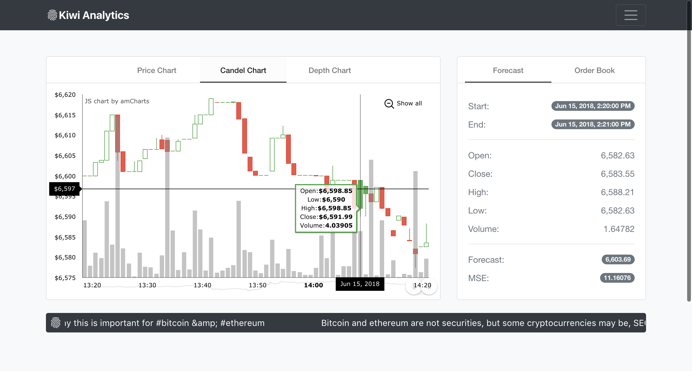
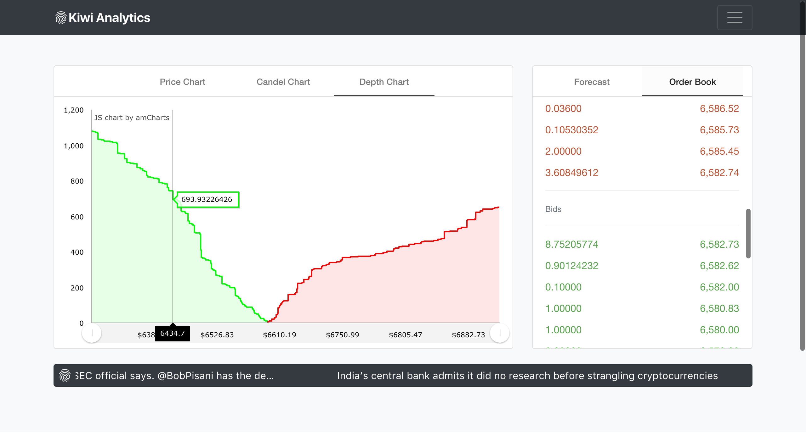

# Kiwi Analytics for Bitcoin
### Table of Contents
* About
* Features
* Screenshots
* Quick Start
* Changelog
* Reference
### About
This is a data-centric, responsive-designed web application. It provides near real-time Bitcoin-USD information and makes forecast on short-term price rates using machine learning techniques.
### Features
1. **Single Page Application**

    This application is a single page application (SPA) powered by Angular framework to bring smooth experience when jumping between pages.

2. **Responsive Web Design**

    Responsive Web Design (RWD) is followed so that consistent user experience can be provided regardless of client-side devices used.

3. **Data-centric Architecture**

    Also as a foreseeable trend, data-centric architecture is employed. In this application, three servers work independently (segregation of duties) and communicate via data only to deliver eventual web services.

### Screenshots

    
    
    
    

### Quick Start
    Prerequisites: 
        1. Node.js 8.0.0
        2. Python 3.6
        3. MongoDB 3.6
        4. One Registered Twitter App (https://apps.twitter.com)

    Installation:
        1. Clone or download the repository.
        2. Set up data-collecting-server
           2.1 Change directory to the 'data-collecting-server' folder under the 'release' folder.
           2.2 Install dependencies via command `npm install`
        3. Set up data-mining-server
           3.1 Change directory to the 'data-mining-server' folder under the 'release' folder.
           3.2 Install dependencies via command `pip install -r requirements.txt`
        4. Set up web-server
           4.1 Change directory to the 'web-server' folder under the 'release' folder.
           4.2 Install dependencies via command `npm install`

    Configuration:
        1. Fill in your Twitter API Configuration in file 'settings.js' under 'data-mining-server' folder under the 'release' folder.

    Run:
        1. Change directory to the 'release' folder under the repo root.
        2. Start mongodb via command `mongod --dbpath ./mongo`.
        3. Start data-collecting-server via command `node ./data-collecting-server/data-collecting-server.js`.
        4. Wait several minutes for the data-collecting-server to collect data until a collection called 'Product' appeared in database 'Bitcoin'.
        5. Start data-mining-server via command `python3 ./data-mining-server/model/LSTM_price_single_step.py`
        6. Start web-server via command `node ./web-server/web-server.js`.
        7. Open browser and type in the address 'localhost:8000'.

    PS:
        1. All three servers have to run in sequence and have to be kept running at all time.
        2. By default the web application can only be accessed via address 'localhost:8000'. However, both host address and port number can be customised by replacing default value with desired value at the last line of the file 'web-server.js' under 'web-server' folder.
### Changelog
2018-06-15 &nbsp;&nbsp;&nbsp; Prototype 1.0 release
### Reference
Theme-Spinner &nbsp;&nbsp;&nbsp; https://github.com/akveo/ngx-admin.git